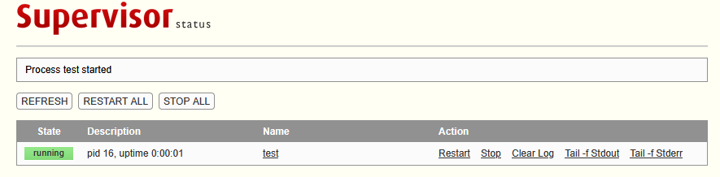

# 介绍

用于在群晖NAS中运行自己的Python脚本服务。
适用于:不想直接开ssh去维护脚本的运行，也不想每个项目都搞个容器来运行的人群


# 使用介绍

镜像名称:miv1n/supervisor-manager:0.0.1

在example中有使用镜像的示例(所有操作都可以在群晖的UI中处理)
1. 将python工程放入services/<工程名>/目录下
2. 入口文件命名为main.py
3. 在compose.yml中添加工程的端口映射


**docker-compose目录结构**

```shell
supervisor-manager/
|-- log/
|   `-- supervisord.log    
|-- services/                  # 存放Python服务，参考“Python服务目录结构”
|-- supervisor/    
|   `-- configs/ 
|       `-- supervisord.conf   # supervisor配置,其中的include是重点
`-- compose.yml       
```

**Python服务目录结构**

```shell
services
|-- testA/
|   |-- main.py           # [必须] python启动入口
|   |-- venv/             # [可选] 虚拟环境目录
|   |-- requirements.txt  # [可选] python依赖
|   `-- config.ini        # [可选] 如果你的程序比较多，可以把端口这样的参数定义在配置中，程序启动后读取配置使用，方便核对compose.yml端口映射有没有遗漏。
`-- testB/
```

# 依赖处理和环境隔离

```py
#虚拟环境存在情况
venv_path = os.path.join(service_path, 'venv')
if not os.path.exists(venv_path):  
    os.system(f'python -m venv {venv_path}')
    print(f"Created virtual environment for {service_name}")

# 确定执行器和入口文件路径
python_path = os.path.join(venv_path, 'bin', 'python')
command = f'{python_path} {main_py}'

# requirements.txt依赖安装
requirements_txt = os.path.join(service_path, 'requirements.txt')
if os.path.exists(requirements_txt):  
    os.system(f'{python_path} -m pip install -r {requirements_txt}')
    print(f"Installed dependencies for {service_name}")
```

# 部署服务

```yaml
version: '3.8'

services:
  supervisor_manager:
    image: miv1n/supervisor-manager:0.0.1
    container_name: supervisor_manager
    ports:
      - "8080:8080"
      - "9001:9001"
    volumes:
      - ./services:/opt/services
      - ./supervisor/configs:/etc/supervisor/conf.d
      - ./log/supervisord.log:/var/log/supervisord.log
    restart: always
```


# 管理页面

地址: `http://ip:9001`



# 后续计划

- [x] 自动安装依赖
- [ ] nginx转发内部服务，服务新增不修改镜像YAML

# 不实现功能

**监听目录变化，自动加载/卸载服务**
原因: 服务不会频繁新增和删除，没有必要耗费资源去监听目录变化